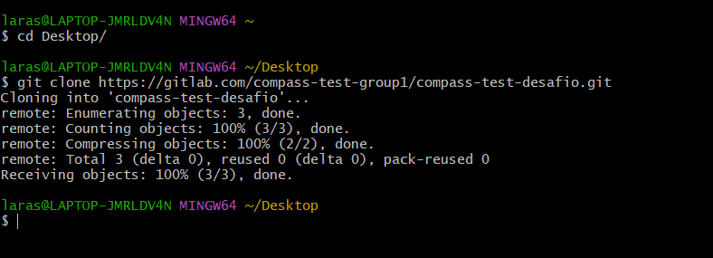

# compass-gitlab-pipelines


### Pré-requisitos
- GitLab Account
- VsCode installed

## GitLab
- Passo 1: Crie um projeto no GitLab


- Passo 2: Clone esse repositório na sua máquina



### VSCode

- Passo 3: Abra o repositório no Vscode 


- Passo 4: Crie o arquivo **gitlab-ci.yml**


- Passo 5: Faça Commit e envie as alterações para o repositório


```
git status
git add . 
git commit -m 'add file'
git push origin main
```


### Volte ao GitLab

 - Na barra lateral esquerda, clique em **"Build"** e depois em **"Pipeline"**, você deve ver a pipeline sendo executada.

